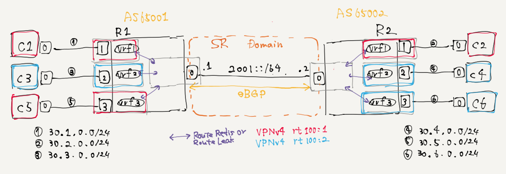

# [DRAFT] MP-BGP VPNv4 per-VRF w/ SRv6 ? (FRR meets SRv6...?)



```
$ cd docker && docker build -t slankdev/fedora-frr:24 .
$ tn upconf | sudo sh
$ docker exec R1 vtysh -c 'show bgp ipv4 vpn'
$ docker exec R1 vtysh -c 'show ip route vrf vrf1'
```

