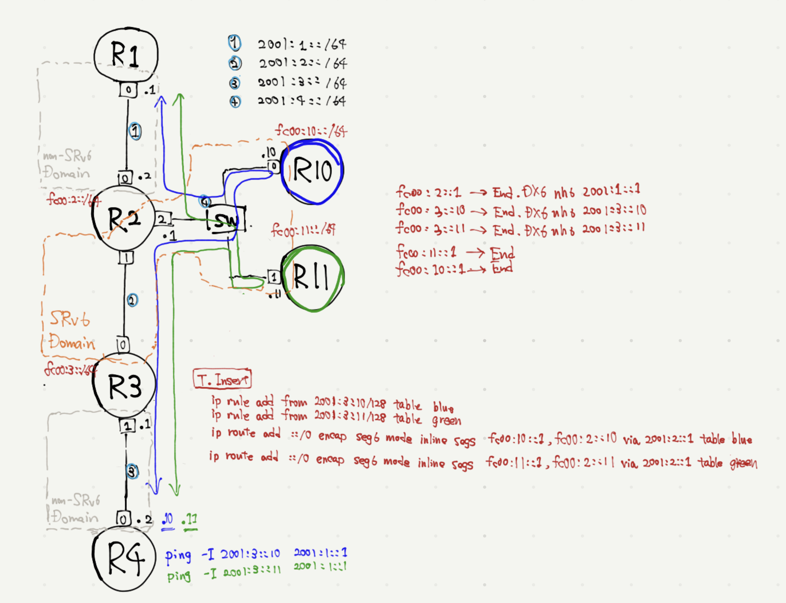

# SFC using SRv6



```
tn upconf | sudo sh
```

make test traffic
```
docker exec -it R4 ping -I 2001:3::2 2001:1::1
docker exec -it R4 ping -I 2001:3::10 2001:1::1
docker exec -it R4 ping -I 2001:3::11 2001:1::1
```

check networking
```
docker exec -it R10 tcpdump -ni net0
docker exec -it R11 tcpdump -ni net0
```
