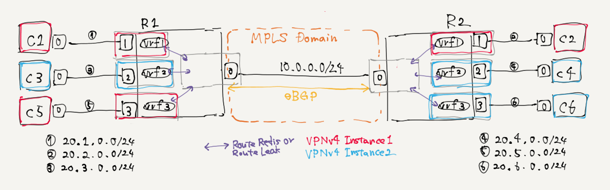

# for frr development



topo
```
          .1                                  .2
      r1 [net0]--------(10.0.0.0/24)--------[net0] r2
	  AS65001                                      AS65002
	  [vrf0]                                        [vrf0]
		[net1]                                        [net1]
			|.1                                           |.1
			|                                             |
			|                                             |
(20.0.0.0/24)                                 (20.1.0.0/24)
			|                                             |
			|                                             |
			|.2                                           |.2
		[net0]                                        [net0]
      c1                                           c2
```

references
- configure example of vpnv4 as small set.
  https://gist.github.com/hkwi/5c116f05667a3abf43c7456fae32a529

glossary
- rt: route target
- rd: route distingisher

## FRR meets SRv6 Implementation..?

```
#R1
router bgp 65001
 bgp router-id 10.255.0.1
 neighbor 2001::2 remote-as 65002
 !
 address-family ipv4 vpn
 exit-address-family
!
router bgp 65001 vrf vrf0
!
router bgp 65001 vrf vrf1
!
segment-routing srv6
 locators
  locator default
   prefix 2001:aaaa::/64
 exit-locator
 !
!

#R2
```
