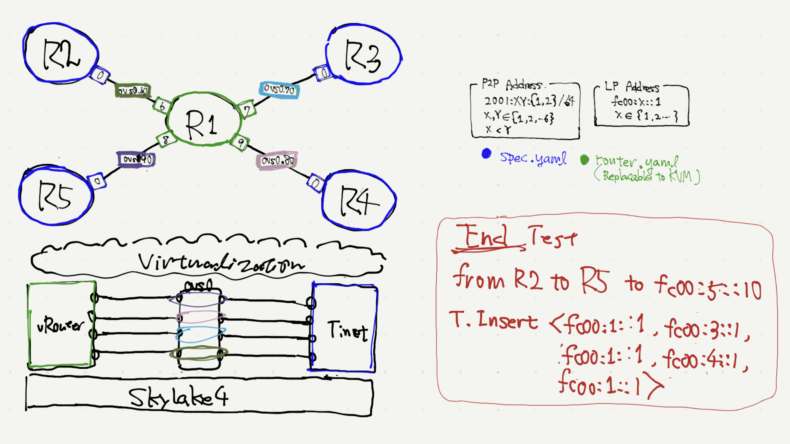

# Test Environment for SRv6-dev
- Hiroki Shirokura <slankdev@coe.ad.jp>
- 2019.01.02

This env is development for End, End.X, End.DX2, End.DX4, End.DX6, End.DT4, End.DT6.



## Evaluation on your laptop Rapidly

TestOperation
```
tn upconf | sudo sh

docker exec -it R2 bash
ip -6 route del fc00:5::1 encap seg6 mode encap segs fc00:1::1,fc00:3::1,fc00:1::1,fc00:4::1,fc00:1::1 dev net0
ip -6 route add fc00:5::1 encap seg6 mode encap segs fc00:1::1,fc00:3::1,fc00:1::1,fc00:4::1,fc00:1::1 dev net0
ping -I fc00:2::1 fc00:5::1
...
```

For Debugger, please execute `$ tmux source-file debug.tmux`.
Then, you can check each interface in/out packets like a following.

```
 +---------------------------+----------------------------+
 | [0] srdump on R2' net0-in | [1] srdump on R2' net0-out |
 +---------------------------+----------------------------+
 | [2] srdump on R3' net0-in | [3] srdump on R3' net0-out |
 +---------------------------+----------------------------+
 | [4] srdump on R4' net0-in | [5] srdump on R4' net0-out |
 +---------------------------+----------------------------+
 | [6] srdump on R5' net0-in | [7] srdump on R5' net0-out |
 +---------------------------+----------------------------+
```

