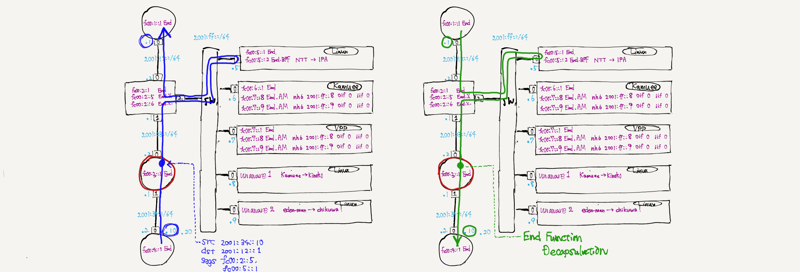

# SFC Testbed


NW construction and test
```
tn upconf | sudo sh
tn test remote | sudo sh
```

## DEMO2: SRv6 Encoder



blue config
```
docker exec R3 ip -6 rule add from 2001:34::10 table 10
docker exec R3 ip -6 route add 2001:12::1 encap seg6 mode inline segs fc00:5::1,fc00:2::1 dev net0 table 10
```

green config
```
docker exec R2 ip -6 route add 2001:34::10 encap seg6 mode inline segs fc00:5::1,fc00:3::1 dev net2
```

## DEMO1: SRv6 Application Proxy

