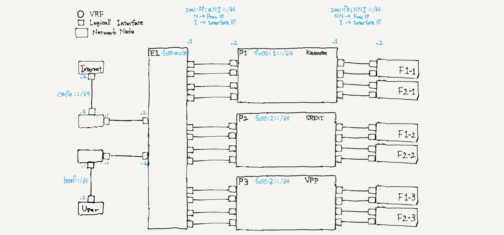

# SFC Testbed



NW construction and test
```
tn upconf | sudo sh
tn test remote | sudo sh
```

## DEMO: SRv6 Application Proxy


**Using srext-proxy**
```
docker exec R3 ip -6 rule add from 2001:34::10 table 10
docker exec R3 ip -6 rule add from 2001:34::20 table 20
docker exec R3 ip -6 route add 2001:12::1 encap seg6 mode inline segs fc00:5::8,fc00:2::1 dev net0 table 10
docker exec R3 ip -6 route add 2001:12::1 encap seg6 mode inline segs fc00:5::8,fc00:5::9,fc00:2::1 dev net0 table 20
docker exec R8 ip -6 route add default via 2001:fe::5
docker exec R9 ip -6 route add default via 2001:fe::5

#util
srconf localsid add SID end.am ip IPv6-ADDR TARGETIF SOURCEIF
srconf localsid show
```

**Using kamuee-proxy**
```
docker exec R3 ip -6 rule add from 2001:34::10 table 10
docker exec R3 ip -6 rule add from 2001:34::20 table 20
docker exec R3 ip -6 route add 2001:12::1 encap seg6 mode inline segs fc00:6::8,fc00:2::1 dev net0 table 10
docker exec R3 ip -6 route add 2001:12::1 encap seg6 mode inline segs fc00:6::8,fc00:6::9,fc00:2::1 dev net0 table 20
docker exec R8 ip -6 route add default via 2001:fe::6
docker exec R9 ip -6 route add default via 2001:fe::6
```

**Check proxy config**
```
docker exec R3 ip -6 rule show && \
docker exec R3 ip -6 route list table 10 && \
docker exec R3 ip -6 route list table 20 && \
docker exec R8 ip -6 route list default && \
docker exec R9 ip -6 route list default
```

**Reset proxy config**
```
docker exec R3 ip -6 route del 2001:12::1 table 10
docker exec R3 ip -6 route del 2001:12::1 table 20
docker exec R3 ip -6 rule del table 10
docker exec R3 ip -6 rule del table 20
docker exec R8 ip -6 route del default
docker exec R9 ip -6 route del default
```

